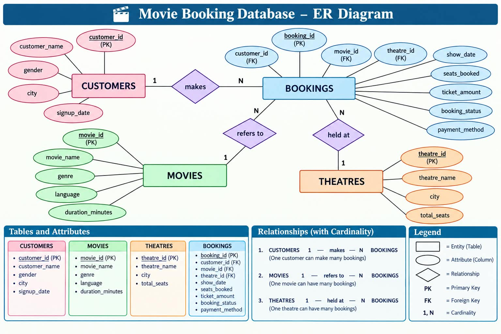

# 🎬 Movie Ticket Booking System — MySQL SQL Project

A MySQL-based relational database project for managing customers, movies, theatres, and movie ticket bookings.

The project demonstrates practical SQL and relational database concepts including database design, primary keys, foreign keys, constraints, CRUD operations, filtering, sorting, aggregate functions, JOINs, GROUP BY, HAVING, subqueries, CTEs, and window functions.

---

## 📌 Project Overview

The Movie Ticket Booking System models a basic movie-ticket booking workflow using a relational database.

The database contains four main entities:

- 👤 Customers
- 🎬 Movies
- 🏢 Theatres
- 🎟️ Bookings

The `bookings` table connects customers, movies, and theatres through foreign-key relationships.

The project progresses from basic SQL operations to multi-table analysis and advanced SQL techniques, allowing booking data to be analyzed from customer, movie, theatre, payment, and revenue perspectives.

---

## 🎯 Objectives

This project focuses on:

- Designing a relational database using MySQL
- Creating related tables
- Applying Primary Key and Foreign Key relationships
- Maintaining referential integrity
- Storing customer, movie, theatre, and booking information
- Practicing SQL filtering and sorting
- Performing aggregate analysis
- Using JOINs across multiple tables
- Using GROUP BY and HAVING
- Writing subqueries
- Practicing CTEs and window functions
- Answering practical movie-booking business questions

---

## 🗄️ Database Structure

**Database:** `movie_booking_db`

| Table | Purpose |
|---|---|
| `customers` | Stores customer information |
| `movies` | Stores movie information |
| `theatres` | Stores theatre information |
| `bookings` | Stores ticket booking information |

### Customers

| Column | Description |
|---|---|
| `customer_id` | Unique customer identifier |
| `customer_name` | Customer name |
| `gender` | Customer gender |
| `city` | Customer city |
| `signup_date` | Customer signup date |

### Movies

| Column | Description |
|---|---|
| `movie_id` | Unique movie identifier |
| `movie_name` | Movie name |
| `genre` | Movie genre |
| `language` | Movie language |
| `duration_minutes` | Movie duration in minutes |

### Theatres

| Column | Description |
|---|---|
| `theatre_id` | Unique theatre identifier |
| `theatre_name` | Theatre name |
| `city` | Theatre city |
| `total_seats` | Total theatre seats |

### Bookings

| Column | Description |
|---|---|
| `booking_id` | Unique booking identifier |
| `customer_id` | Customer reference |
| `movie_id` | Movie reference |
| `theatre_id` | Theatre reference |
| `show_date` | Movie show date and time |
| `seats_booked` | Number of seats booked |
| `ticket_amount` | Booking amount |
| `booking_status` | Booking status |
| `payment_method` | Payment method |

---

## 🔗 ER Diagram & Database Relationships

The following ER diagram represents the complete database design of the Movie Ticket Booking System, including entities, attributes, primary keys, foreign keys, relationships, and cardinality.

<p align="center">
  
</p>

### Diagrammatic ER Structure

The same database structure is also represented below using a Mermaid ER diagram.

```mermaid
erDiagram

    CUSTOMERS ||--o{ BOOKINGS : makes
    MOVIES ||--o{ BOOKINGS : refers_to
    THEATRES ||--o{ BOOKINGS : held_at

    CUSTOMERS {
        int customer_id PK
        varchar customer_name
        varchar gender
        varchar city
        date signup_date
    }

    MOVIES {
        int movie_id PK
        varchar movie_name
        varchar genre
        varchar language
        int duration_minutes
    }

    THEATRES {
        int theatre_id PK
        varchar theatre_name
        varchar city
        int total_seats
    }

    BOOKINGS {
        int booking_id PK
        int customer_id FK
        int movie_id FK
        int theatre_id FK
        datetime show_date
        int seats_booked
        decimal ticket_amount
        varchar booking_status
        varchar payment_method
    }
